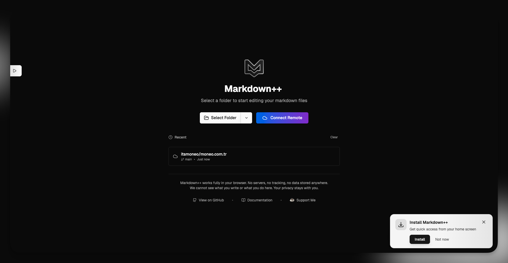

# Markdown++

**A powerful, browser-based content management panel for static site generators. Edit, organize, and publish Markdown files with a beautiful UI. No backend, no database, no complexity.**

[](https://markdown-plus-plus.com/)


## 🎬 Demo

[](https://youtu.be/dyUUNJkQqR8)

## 💡 Why Markdown++?

Static site generators (Hugo, Jekyll, Astro, Next.js) are amazing for building fast, secure websites. But managing Markdown files manually? That's where things get tedious.

**The Problem:**
- Editing raw Markdown files in a code editor is slow and error-prone
- Managing frontmatter (metadata) across multiple files is painful
- Creating new posts requires copying templates and manually updating fields
- Finding and organizing content across folders is time-consuming
- Collaborating with non-technical team members is nearly impossible

**The Solution:**

Markdown++ gives you a modern, WordPress-like admin panel for your static site—without any of the complexity. It runs entirely in your browser, connects directly to your local file system, and lets you:

- **Browse** all your posts in a sortable, filterable table
- **Edit** with a beautiful WYSIWYG editor (like Medium or Notion)
- **Manage** frontmatter with smart, auto-detected form fields
- **Create** new posts with pre-filled templates
- **Publish** to Git with one click
- **Connect Remote Repos** - Work directly with GitHub/GitLab without downloading files
- **Collaborate** by deploying the app with authentication

### Key Advantages

- ✅ **No backend** - Runs entirely in your browser using modern web APIs
- ✅ **No database** - Your files stay on your computer, no cloud storage needed
- ✅ **Zero setup** - Just open the app and select your folder (or try the demo!)
- ✅ **Remote-first** - Connect GitHub/GitLab repos and edit directly (no downloads!)
- ✅ **Privacy-first** - No tracking, no data collection, completely offline-capable
- ✅ **Works on iOS** - Remote mode works on iPhone/iPad (local mode needs desktop)
- ✅ **Works on Android** - Edit your site from your phone or tablet
- ✅ **Git-integrated** - Commit and push changes with a single button
- ✅ **Framework-agnostic** - Works with any static site generator
- ✅ **Demo mode** - Explore all features without touching your files

Built for developers who love static sites but want a better content editing experience.

## ✨ Features

### 📝 Content Editing
- **WYSIWYG Editor** - Beautiful, distraction-free editor powered by Tiptap with rich text formatting
  - Bold, italic, underline, strikethrough
  - Headings (H1-H6)
  - Lists (ordered, unordered, task lists)
  - Links and images
  - Code blocks with syntax highlighting
  - Tables
  - Text alignment
  - And much more...
- **Raw Markdown View** - Switch to raw Markdown mode for direct editing
- **Live Preview** - See how your content looks as you type
- **Quick Save** - Keyboard shortcuts (Ctrl/Cmd + S) for fast saving

### 🗂️ Content Management
- **File Browser** - Navigate through your folder structure with a visual file tree
  - Resizable sidebar for optimal workspace
  - Drag & drop files between folders to reorganize
  - Filter by folder to focus on specific content
- **Table View** - See all your posts in a sortable, searchable data table
  - Sort by title, date, status, or any custom field
  - Filter posts by text search
  - Multi-column display of all frontmatter fields
  - Configurable column visibility
- **Smart Metadata Editor** - Auto-detects frontmatter structure and creates appropriate input fields
  - Text inputs for strings
  - Date pickers for dates
  - Checkboxes for booleans
  - Array inputs for lists
  - Supports custom fields of any type
- **CRUD Operations** - Create, read, update, and delete posts directly from the UI
- **File Management** - Rename files and move them between folders with drag & drop
- **Related Posts** - Automatically link posts by canonical URL for multilingual sites
- **Bulk Operations** - Manage multiple files efficiently

### 🚀 Git Integration & Remote Repositories
- **Remote Repository Support** - Connect directly to GitHub or GitLab repos
  - OAuth authentication flow (secure & easy)
  - Personal Access Token support
  - Browse all your repositories
  - Select branch to work on
  - Auto-commits on save
  - Works on iOS/iPad (no File System API needed!)
- **One-Click Publishing** - Commit and push changes to Git with a single button (local mode)
- **CORS Proxy Support** - Pushes via cors.isomorphic-git.org to bypass browser restrictions
- **Smart Error Handling** - Categorized errors with specific solutions (auth, network, rate limit, etc.)
- **Personal Access Token** - Secure authentication for GitHub and GitLab private repos
- **Auto-Commit Messages** - Intelligent commit messages generated from your changes
- **Branch Detection** - Automatically detects your current Git branch
- **Concurrent Protection** - Prevents multiple simultaneous publish operations
- **Platform Detection** - Different authentication for GitHub vs GitLab
- **Retry Mechanism** - "Try Again" button with error recovery
- **Copy Error Details** - Copy full error messages for debugging
- **Console Logging** - Detailed [Git Publish] logs for troubleshooting
- **Git Status** - See which files have been modified
- **Works in Browser** - No server needed, uses isomorphic-git and GitHub/GitLab APIs

### 🔧 Smart Features
- **Demo Mode** - Try the app without selecting files - explore with sample content
- **Auto-Save Drafts** - Your work is continuously saved to browser storage
- **Persistent Workspace** - Your selected folder and preferences are remembered
  - Recent folders list for quick access
  - Restores your last open file on return
  - Remembers theme and layout preferences
- **Quick Theme Switcher** - Change between light, dark, and system themes from the header
- **Column Customization** - Show/hide columns in the table view
- **File Filtering** - Hide system files and folders (dotfiles, node_modules, etc.)
- **Settings Panel** - Customize the editor behavior and appearance
- **Favicon Badge** - Shows unsaved changes indicator in browser tab
- **Visual Feedback** - Confetti celebrations when saving, smooth animations throughout
- **Smart Header** - Shows current post title when scrolling in editor

### 🌐 Deployment & Access
- **PWA Support** - Install as a native app on desktop and Android
- **Offline Capable** - Works without internet connection
- **Self-Hostable** - Deploy your own instance with optional authentication
- **Zero Configuration** - No config files, no setup required
- **Mobile Optimized** - Fully functional on Android devices (iOS not supported due to platform limitations)

## 🚀 Quick Start

### Option 1: Use the Hosted Version (Recommended)
The easiest way to get started—no installation required!

1. Visit <a href="https://markdown-plus-plus.com/" style="text-decoration:none;">markdown-plus-plus.com</a>
2. Choose your workflow:
   - **"Connect Remote"** - Work with GitHub/GitLab repos (works on iOS/iPad!)
   - **"Select Folder"** - Work with local files (desktop only)
   - **"Try Demo"** - Explore without any setup
3. If connecting remote:
   - Click "Connect Remote"
   - Choose GitHub or GitLab
   - Enter your Personal Access Token or use OAuth
   - Select repository and branch
   - Start editing!
4. If using local files:
   - Click "Select Folder"
   - Grant browser permission to access the folder
   - Start editing!

**Note:** All processing happens in your browser. Local files never leave your computer. Remote mode connects directly to GitHub/GitLab APIs.

### Option 2: Run Locally
Perfect for development or offline use:

```bash
# Clone the repository
git clone https://github.com/emir/markdown-plus-plus.git
cd markdown-plus-plus

# Install dependencies
npm install

# Start development server
npm run dev

# Open http://localhost:5173
```

### Option 3: Deploy Your Own Instance
Deploy to your own server with optional authentication:

```bash
# Build for production
npm run build

# The dist/ folder contains the complete static app
# Deploy to any static hosting service:
# - Cloudflare Pages
# - Vercel
# - Netlify
# - GitHub Pages
# - Your own server

# Optional: Add HTTP Basic Auth for team access
# Configure in your hosting provider's settings
```

## 📖 How to Use

### First-Time Setup

#### Option A: Remote Repository (Recommended for Mobile/iOS)

1. **Open the App**
   - Visit the hosted version or run locally
   - You'll see a welcome screen with "Connect Remote" button

2. **Connect to Your Repository**
   - Click "Connect Remote"
   - Choose **GitHub** or **GitLab**
   - Enter your Personal Access Token:
     - **GitHub**: [Create token](https://github.com/settings/tokens) with `repo` scope
     - **GitLab**: [Create token](https://gitlab.com/-/user_settings/personal_access_tokens) with `api`, `read_user`, `write_repository` scopes
   - Browse your repositories
   - Select the repository and branch you want to work on
   - Click "Connect"

3. **Start Editing**
   - All markdown files will be loaded automatically
   - Use the **File Browser** (left sidebar) to navigate folders
   - Use the **Table View** (main area) to see all posts at once
   - Click any post to start editing
   - **Saves auto-commit** to your repository!

#### Option B: Local Files (Desktop Only)

1. **Open the App**
   - Visit the hosted version or run locally
   - You'll see a welcome screen

2. **Select Your Content Folder**
   - Click "Select Folder" 
   - Choose the folder containing your Markdown files
   - Grant browser permission when prompted
   - The app will scan and load all `.md` files

3. **Explore Your Content**
   - Use the **File Browser** (left sidebar) to navigate folders
   - Use the **Table View** (main area) to see all posts at once
   - Click any post to start editing

### Daily Workflow

1. **Browse & Search**
   - View all posts in the table
   - Sort by any column (title, date, status, etc.)
   - Use the search box to filter posts
   - Filter by folder using the file tree sidebar
   - Configure visible columns in settings

2. **Edit Content**
   - Click a post to open the editor
   - Edit frontmatter fields in the top panel
   - Edit content in the WYSIWYG editor
   - Switch to raw Markdown mode if needed
   - Press `Ctrl/Cmd + S` to save
   - Enjoy the confetti celebration! 🎉

3. **Organize Files**
   - Drag and drop files between folders in the file tree
   - Rename files directly in the editor
   - Resize the file tree sidebar to your preference
   - Hide files you don't want to see

4. **Create New Posts**
   - Click "New Post" button
   - Posts are created in the currently selected folder
   - Fill in the frontmatter fields
   - Write your content
   - Save to create the file

5. **Publish Changes**
   - Click "Publish" button in the editor
   - Review the auto-generated commit message
   - Edit the message if needed
   - Click "Publish" to commit and push to Git

6. **Manage Settings**
   - Click the settings dropdown in the header
   - Quickly switch themes (light/dark/system)
   - Access advanced settings
   - Show/hide table columns
   - Configure file filtering

### Tips & Tricks

- **Keyboard Shortcuts:** Use `Ctrl/Cmd + S` to save quickly
- **Try Before You Commit:** Use demo mode to explore the app without touching your files
- **Recent Folders:** Quickly access your frequently used projects from the welcome screen
- **Persistent State:** Your selected folder is remembered between sessions
- **File Organization:** Drag and drop files in the file tree to reorganize your content
- **Mobile Editing:** Works great on Android Chrome and Edge
- **Offline Work:** Edit without internet; push changes when online
- **Multiple Languages:** Use canonical URLs to link related posts in different languages
- **Custom Workspace:** Resize the file tree sidebar to fit your workflow
- **Visual Cues:** Watch for the favicon badge showing unsaved changes

**That's it!** No configuration files, no database setup, no complexity.

### 🚢 Publishing to Git

Markdown++ includes built-in Git integration that works entirely in your browser—no server or external tools required.

**How It Works:**

1. **Make Your Changes**
   - Edit content in the WYSIWYG editor
   - Update frontmatter fields
   - Save your changes (Ctrl/Cmd + S)

2. **Configure Git Settings (One-Time)**
   - Go to Settings → Git tab
   - Enter your name and email
   - For private repos: Add your Personal Access Token (see below)

3. **Click Publish**
   - Look for the "Publish" button in the editor toolbar
   - Only appears when editing a file in a Git repository

4. **Review & Confirm**
   - See the auto-generated commit message (e.g., "Update: post-title.md")
   - Edit the message if needed
   - Click "Publish" to proceed

5. **Automatic Git Operations**
   - ✅ Stages the file: `git add <file>`
   - ✅ Commits changes: `git commit -m "message"`
   - ✅ Pushes to remote: `git push origin <branch>` (via CORS proxy)
   - All done in your browser using [isomorphic-git](https://isomorphic-git.org/)

**🔐 Authentication Setup**

For pushing to **private repositories**, you need a Personal Access Token:

**GitHub:**
1. Go to [GitHub Settings → Tokens](https://github.com/settings/tokens)
2. Click "Generate new token (classic)"
3. Select scopes: `repo` (full control of private repositories)
4. Copy the token and paste it in Settings → Git → Personal Access Token

**GitLab:**
1. Go to [GitLab Settings → Access Tokens](https://gitlab.com/-/user_settings/personal_access_tokens)
2. Create a new token with `write_repository` scope
3. Copy the token and paste it in Settings → Git → Personal Access Token

**Public repositories** don't require a token.

**🌐 CORS Proxy**

Browser security (CORS policy) prevents direct push to Git servers. Markdown++ uses the free [cors.isomorphic-git.org](https://cors.isomorphic-git.org) proxy service to bypass this limitation. Your code and credentials pass through this proxy to reach GitLab/GitHub.

**Security Notes:**
- Tokens are stored locally in your browser (localStorage)
- HTTPS connection encrypts token in transit
- For maximum security, use repository-specific tokens with minimal scopes
- Never share your tokens or commit them to code

**Requirements:**

- Your folder must be a Git repository (`.git` folder present)
- HTTPS remote URL (SSH not supported in browser)
- For private repos: Personal Access Token configured in Settings
- An active internet connection for pushing changes

**🛡️ Smart Error Handling**

Markdown++ provides detailed error messages with actionable solutions:

| Error Type | What It Means | Solution |
|------------|---------------|----------|
| **🔐 Authentication Error** | Token missing/invalid | Add/update token in Settings → Git |
| **🌐 Network Error** | No internet/CORS proxy down | Check connection, retry in moments |
| **⏱️ Rate Limit** | Too many requests | Wait a few minutes before retry |
| **🚫 Permission Denied** | No write access | Check repo permissions, update token |
| **❌ Repository Not Found** | Repo deleted/no access | Verify repo URL and access rights |

**Features:**
- ✅ **Concurrent Protection:** Prevents multiple simultaneous publishes
- ✅ **Automatic Retries:** "Try Again" button after failures
- ✅ **Copy Error:** Copy full error message for debugging
- ✅ **Console Logs:** Detailed logs in browser console (F12)
- ✅ **Context-Aware:** Different advice for GitHub vs GitLab

**Common Issues & Solutions:**

**❌ "Not a Git repository"**
```bash
# Initialize Git in your project root
git init
git remote add origin https://github.com/user/repo.git
```

**❌ "SSH protocol cannot be pushed from browser"**
```bash
# Change SSH to HTTPS
git remote set-url origin https://github.com/user/repo.git
# For GitLab
git remote set-url origin https://gitlab.com/user/repo.git
```

**❌ "Authentication failed (401)"**
- Go to Settings → Git
- Add Personal Access Token with correct scopes
- GitHub: `repo` scope | GitLab: `write_repository` scope

**❌ "Permission denied (403)"**
- Verify you're a collaborator on the repository
- Check token hasn't expired or been revoked
- Ensure token has write permissions
- Protected branches may require admin access

**❌ "Network error / CORS timeout"**
- Check your internet connection
- CORS proxy might be temporarily down
- Try again in a few moments
- Use manual push as fallback

**❌ "Rate limit exceeded (429)"**
- You've made too many requests
- Wait 5-10 minutes before retrying
- Manual push works immediately

**💡 Best Practices:**

1. **First Time Setup:**
   - Configure name, email, and token in Settings
   - Test with a small change first
   - Verify token has correct permissions

2. **Daily Usage:**
   - Save before publishing (Ctrl/Cmd + S)
   - Review commit message
   - Wait for "Successfully published" confirmation
   - Don't click multiple times (protected automatically)

3. **When Push Fails:**
   - Read the error message carefully
   - Check Settings → Git configuration
   - Use "Copy Error" button for debugging
   - Check browser console (F12) for detailed logs
   - Manual push always works as fallback

**Alternative: Manual Push**

Browser push uses CORS proxy and may occasionally fail. You can always:

1. **Commit via browser:** Click "Publish" - commits locally
2. **Push via terminal:** Use command shown in modal
3. **Or use GUI tools:** GitHub Desktop, GitKraken, SourceTree

```bash
# Modal provides this command:
cd your-project
git push origin main
```

The Git integration is **completely optional**—you can edit and save files without it!

## 🛠️ Tech Stack

**Core Technologies:**
- **React 19** - Modern UI framework with latest features
- **TypeScript** - Type-safe development
- **Vite 7** - Lightning-fast build tool and dev server
- **Tailwind CSS** - Utility-first styling framework

**Rich Text Editing:**
- **Tiptap** - Powerful, extensible WYSIWYG editor
- **Lowlight** - Syntax highlighting for code blocks
- **Marked** - Markdown parsing and rendering
- **Turndown** - HTML to Markdown conversion

**File & Data Management:**
- **File System Access API** - Native browser file system integration
- **IndexedDB** - Local storage for state persistence
- **gray-matter** - Frontmatter parsing and serialization

**Git Integration:**
- **isomorphic-git** - Complete Git implementation in JavaScript
- **CORS Proxy** - cors.isomorphic-git.org for browser push operations
- **buffer** - Buffer polyfill for browser Git operations
- **Smart Error Detection** - Categorized error handling with actionable solutions

**UI Components:**
- **Lucide React** - Beautiful, consistent icons
- **Tailwind Merge** - Intelligent Tailwind class merging
- **Custom Components** - Hand-crafted, accessible UI elements

**Testing:**
- **Vitest** - Fast, modern test runner
- **@vitest/coverage-v8** - Code coverage reports
- **jsdom** - DOM implementation for testing

This stack enables a completely client-side application with no server dependencies while maintaining enterprise-grade capabilities.

## 🌐 Browser Support

Markdown++ uses the **File System Access API**, which is required for direct file system access from the browser.

| Browser | Platform | Version | Status | Notes |
|---------|----------|---------|--------|-------|
| Chrome | Desktop | 86+ | ✅ Full support | Recommended |
| Chrome | Android | 86+ | ✅ Full support | Fully functional |
| Edge | Desktop | 86+ | ✅ Full support | Chromium-based |
| Edge | Android | 86+ | ✅ Full support | Fully functional |
| Safari | macOS | 15.2+ | ✅ Full support | Requires macOS Sonoma+ |
| Safari | iOS/iPadOS | Any | ❌ Not supported | Apple platform limitation |
| Chrome | iOS/iPadOS | Any | ❌ Not supported | Uses Safari engine |
| Edge | iOS/iPadOS | Any | ❌ Not supported | Uses Safari engine |
| Firefox | All | - | ❌ Not supported yet | API not implemented |

**Why iOS Doesn't Work:**

iOS and iPadOS do not support the File System Access API in any browser (Safari, Chrome, Edge, etc.) due to Apple's platform restrictions. All browsers on iOS must use Safari's engine (WebKit), which doesn't implement this API.

**Recommended Setup:**
- **Desktop:** Chrome, Edge, or Safari 15.2+ on macOS
- **Mobile:** Chrome or Edge on Android devices
- **Best Experience:** Desktop Chrome or Edge for full feature access

**Can I Use It?**

Check [caniuse.com/native-filesystem-api](https://caniuse.com/native-filesystem-api) for the latest browser compatibility information.

## 📝 Frontmatter Support

Markdown++ intelligently detects and manages frontmatter (YAML metadata) in your Markdown files—no configuration required.

### Supported Field Types

The app automatically creates the appropriate input field based on the field's value:

**Strings**
```yaml
title: "My Awesome Post"
slug: "my-awesome-post"
```
→ Text inputs

**Dates**
```yaml
date: 2025-11-03
publishedAt: 2025-11-03T10:30:00Z
```
→ Date/time pickers

**Booleans**
```yaml
published: true
featured: false
```
→ Checkboxes

**Arrays**
```yaml
tags: [react, typescript, web]
categories: ["Tech", "Tutorial"]
```
→ Multi-value inputs with add/remove buttons

**Numbers**
```yaml
readingTime: 5
rating: 4.5
```
→ Number inputs

**Custom Fields**
```yaml
author: "John Doe"
seo_description: "Learn how to..."
custom_anything: "Your value"
```
→ Automatically detected and editable

### Example Frontmatter

```yaml
---
title: "Getting Started with React 19"
date: 2025-11-06
author: "Jane Developer"
published: true
featured: false
tags: [react, javascript, tutorial]
categories: ["Web Development"]
readingTime: 8
canonical: "/blog/getting-started-react-19"
relatedPosts:
  - "/blog/react-hooks-guide"
  - "/blog/typescript-basics"
---
```

### Framework Compatibility

Works with any static site generator:
- ✅ **Hugo** - All frontmatter formats
- ✅ **Jekyll** - YAML front matter
- ✅ **Astro** - Markdown with frontmatter
- ✅ **Next.js** - MDX and Markdown
- ✅ **Gatsby** - GraphQL-friendly frontmatter
- ✅ **Eleventy (11ty)** - Any format
- ✅ **VuePress** - Vue-based sites
- ✅ **Docusaurus** - Documentation sites
- ✅ **Custom** - Any Markdown-based system

The app preserves your exact frontmatter structure and only updates the fields you edit.

## 🔐 Privacy & Security

Markdown++ is built with privacy as a core principle.

**What We DON'T Do:**
- ❌ No data collection
- ❌ No analytics or tracking
- ❌ No cookies
- ❌ No telemetry
- ❌ No external API calls
- ❌ No cloud storage
- ❌ No user accounts

**How Your Data Stays Private:**
- ✅ **100% Client-Side** - All processing happens in your browser
- ✅ **Local File Access** - Uses native browser APIs to read/write files directly
- ✅ **IndexedDB Storage** - Preferences and tokens stored locally in your browser
- ✅ **Minimal Network** - Only Git push/pull operations communicate externally
- ✅ **CORS Proxy** - Git operations go through cors.isomorphic-git.org (open source proxy)
- ✅ **HTTPS Encrypted** - All network traffic is encrypted
- ✅ **Open Source** - Inspect the code yourself on GitHub

**For Team Deployments:**

If you deploy your own instance for team access, you can add authentication:
- Use HTTP Basic Auth via your hosting provider
- Add OAuth with a reverse proxy
- Use VPN or firewall rules to restrict access
- Deploy behind your company's SSO

Your files and content never leave your infrastructure.

## 🚀 Use Cases

Markdown++ is perfect for:

**Blog Management**
- Manage posts for Hugo, Jekyll, or Next.js blogs
- Edit frontmatter and content with a visual editor
- Preview and organize posts in a table view
- Reorganize content with drag & drop

**Documentation Sites**
- Edit documentation for Docusaurus, VuePress, or MkDocs
- Manage technical content with code highlighting
- Keep docs up-to-date with Git integration
- Move files between sections easily

**Multilingual Content**
- Link related posts across languages with canonical URLs
- Manage translations side-by-side
- Keep frontmatter synchronized
- Organize by language folders

**Marketing Teams**
- Give non-technical team members an easy editing interface
- Review and edit landing page content
- Publish changes without touching code
- Try changes in demo mode before committing

**Personal Knowledge Base**
- Manage your personal Markdown notes
- Organize content with tags and categories
- Keep everything in version control
- Quick access to recent projects

## ❓ Frequently Asked Questions

### Is my data safe?
Yes! All your files stay on your computer. The app runs entirely in your browser and never sends your content to any server. Only Git operations (if you use them) communicate with your Git remote.

### Do I need to install anything?
No! Just open the web app in a supported browser. You can try the demo mode immediately, or select a folder to work with your own files. For local development, you'll need Node.js and npm.

### Can I use this offline?
Yes! After the initial load, the app works completely offline. You can edit and save files without an internet connection. Demo mode works offline too. You'll only need internet to push changes to Git.

### Does it work with my static site generator?
Yes! Markdown++ works with any tool that uses Markdown files with YAML frontmatter: Hugo, Jekyll, Next.js, Astro, Gatsby, Eleventy, VuePress, Docusaurus, and more.

### Why doesn't it work on my iPhone/iPad?
iOS and iPadOS don't support the File System Access API that Markdown++ requires. This is an Apple platform limitation, not something we can fix. Use Chrome or Edge on Android or a desktop browser instead.

### Can I use this with my team?
Absolutely! Deploy your own instance with authentication (HTTP Basic Auth, OAuth, etc.) and share it with your team. Everyone's edits can be pushed to your shared Git repository.

### Will this modify my files?
The app only modifies files when you explicitly save changes. It preserves your original file structure and formatting. Always use Git to track changes and create backups!

### Can I customize the editor?
Yes! The settings panel lets you configure editor behavior, visible columns, and more. The app is also open source, so you can modify it to fit your needs.

### What about my private Git repositories?
For private repos, you need a Personal Access Token. Go to Settings → Git and add your token:
- **GitHub:** [Create token](https://github.com/settings/tokens) with `repo` scope
- **GitLab:** [Create token](https://gitlab.com/-/user_settings/personal_access_tokens) with `api`, `read_user`, `write_repository` scopes

Tokens are stored locally in your browser and never sent to our servers.

### Why does Git push fail in the browser?
Browser push uses a CORS proxy and may fail due to:
- Missing or invalid Personal Access Token
- No internet connection / CORS proxy down
- SSH protocol (change to HTTPS: `git remote set-url origin https://...`)
- Rate limiting from too many requests
- No write permissions on repository

The error message will tell you exactly what's wrong and how to fix it. You can always commit locally and push via terminal as a fallback.

### Can I push to SSH repositories?
No, SSH protocol doesn't work in browsers. Change your remote to HTTPS:
```bash
git remote set-url origin https://github.com/user/repo.git
```
Then add your Personal Access Token in Settings → Git.

### What if multiple people click Publish at once?
The app prevents concurrent publish operations automatically. Only one publish can run at a time, preventing duplicate commits or race conditions.

### How do I report a bug or request a feature?
Open an issue on GitHub! We welcome bug reports, feature requests, and contributions from the community.

## 🤝 Contributing

Contributions are welcome! Whether it's:
- 🐛 Bug reports
- 💡 Feature suggestions
- 📖 Documentation improvements
- 🔧 Code contributions

Please open an issue or pull request on GitHub.

## 💬 Support & Feedback

- **Issues:** Report bugs or request features on GitHub
- **Discussions:** Join the conversation in GitHub Discussions
- **Questions:** Open an issue with the "question" label

Your feedback helps make Markdown++ better!

## 📄 License

MIT License - Free for personal and commercial use.

See [LICENSE](LICENSE) file for details.

---

**For developers, writers, and teams working with static sites.**
A familiar editing experience, without heavy platforms or dashboards.